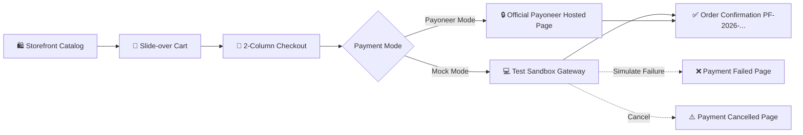

# PayFlow — Payoneer Checkout (MERN Stack)

> **Enterprise-Ready Full-Stack E-Commerce & Payoneer Hosted Checkout System**  
> Built with Node.js, Express, TypeScript, React 18, Vite, Tailwind CSS, and MongoDB/Mongoose.

[](https://www.typescriptlang.org/)
[](https://react.dev/)
[](https://expressjs.com/)
[](https://tailwindcss.com/)
[](https://vitest.dev/)
[](#security--pci-compliance)

---

## 🌟 Executive Overview

**PayFlow** is a modern e-commerce checkout application designed specifically to integrate with **Payoneer's Checkout (Oscato) Hosted API**. It delivers an authentic fintech checkout experience, strictly adheres to zero-trust server validation, isolates credentials via a modular Payment Provider pattern, and supports an out-of-the-box **Mock Mode** for immediate demonstration without requiring active credentials.

### Key Architectural Highlights
- **Official Payoneer API Standard**: Implements `POST /api/lists` with Basic Authentication (`MERCHANT_CODE:API_TOKEN`), initializing hosted sessions with `integration: "HOSTED"`.
- **Zero-Trust Server Validation**: Client prices and totals are never trusted. All catalog items, taxes (8.25%), discounts, and shipping tiers are validated and re-computed on the server.
- **PCI DSS Level 1 SAQ A Compliance**: Zero cardholder data (PAN, CVV, PIN, expiration) touches the application database. Customer enters sensitive data directly on Payoneer's PCI-certified hosted checkout page.
- **Provider Pattern**: Abstract `IPaymentProvider` interface enables switching between `PAYMENT_MODE=mock` and `PAYMENT_MODE=payoneer` via a single environment variable.
- **Resilient Data Layer**: Supports real MongoDB connections as well as a zero-dependency in-memory fallback store (`dataStore.ts`) for instant local testing without spinning up background daemons.

---

## 🚀 Quick Start Guide

### Prerequisites
- **Node.js** >= 18.0.0
- **npm** >= 9.0.0
- *(Optional)* Local or Atlas MongoDB instance

### 1. Installation
Clone the repository and install root, server, and client dependencies:
```bash
git clone <repo-url>
cd "Checkout page"
npm install
npm run install:all
```

### 2. Configure Environment Variables
Copy `.env.example` to `server/.env`:
```bash
cp .env.example server/.env
```

Default configuration for **Mock Mode** (Run immediately without credentials):
```env
PORT=5000
NODE_ENV=development
CLIENT_URL=http://localhost:5173
PAYMENT_MODE=mock

# Payoneer Sandbox Configuration (Used when PAYMENT_MODE=payoneer)
PAYONEER_SANDBOX_URL=https://api.sandbox.oscato.com
PAYONEER_MERCHANT_CODE=YOUR_MERCHANT_CODE
PAYONEER_API_TOKEN=YOUR_API_TOKEN
PAYONEER_DIVISION=YOUR_STORE_DIVISION
```

### 3. Build & Run
Compile both backend and frontend:
```bash
npm run build
```

Run both backend (`localhost:5000`) and client (`localhost:5173`) concurrently:
```bash
npm run dev
```

Visit **[http://localhost:5173](http://localhost:5173)** in your browser.

---

## 🧪 Testing

Run the automated test suite powered by Vitest:
```bash
npm test
```
The test suite validates:
1. **Order Number Generation**: Sequential format (`PF-YYYY-XXXXXX`).
2. **Provider Pattern & Mock Transitions**: State transitions (`PENDING` ➔ `PAID` / `FAILED` / `CANCELLED`).
3. **Payoneer Credential Isolation**: Throws descriptive errors when credentials are absent in `payoneer` mode.
4. **Input Validation**: Rejects invalid emails, empty carts, and missing address fields.
5. **System Health & REST Endpoints**: Confirms API availability and error handling.

---

## 🛒 Application User Journey



1. **Storefront (`/`)**: Browse catalog items (Audio, Peripherals, Wearables, Accessories) with real-time stock counters and currency toggle.
2. **Slide-over Cart**: Increment/decrement quantities, view subtotal, tax, and estimated shipping.
3. **Two-Column Checkout (`/checkout`)**: Shipping details, billing address toggles, summary breakdown, and Payoneer security seals.
4. **Payment Gateway**:
   - In **Mock Mode**: Redirects to the developer test sandbox (`/checkout/mock-gateway`) providing one-click simulation for **Success**, **Declined/Failed**, and **Cancelled** outcomes.
   - In **Payoneer Mode**: Redirects customer to Payoneer's secure hosted payment page.
5. **Order Confirmation (`/checkout/confirmation`)**: Summary with downloadable receipt, transaction ID, and tracking status.
6. **Admin Operations Bench (`/admin`)**: Live dashboard showing revenue, payment conversion rates, order ledger, and simulated webhook testing.

---

## 📂 Project Structure

```
Checkout page/
├── client/                     # Vite + React 18 + Tailwind CSS Frontend
│   ├── src/
│   │   ├── components/         # Navbar, CartDrawer, Footer, Toast
│   │   ├── context/            # CartContext (local storage persisted)
│   │   ├── pages/              # Storefront, Checkout, Confirmation, Admin, etc.
│   │   ├── services/           # Axios API client (zero-trust contract)
│   │   └── types/              # TypeScript interfaces (Order, Product, Payment)
│   └── vite.config.ts
├── server/                     # Node.js + Express + TypeScript Backend
│   ├── src/
│   │   ├── config/             # database.ts & dataStore.ts (Mongoose + In-Memory fallback)
│   │   ├── controllers/        # Order, Payment, Product, Webhook, Admin
│   │   ├── middleware/         # Validation, Rate-limiting, Error handling
│   │   ├── models/             # Mongoose schemas (Order, Payment, Product, Webhook)
│   │   ├── routes/             # REST API routers
│   │   ├── services/payment/   # IPaymentProvider, PayoneerProvider, MockProvider
│   │   └── utils/              # Logger (token/PAN redaction), Order number generator
│   └── tests/                  # Vitest automated test suite
├── docs/
│   ├── PAYONEER-INTEGRATION.md # Comprehensive Payoneer Hosted Checkout guide
│   ├── API.md                  # REST API contract & endpoints documentation
│   └── ARCHITECTURE.md         # System design, data flow & security architecture
└── package.json                # Monorepo root scripts
```

---

## 🛡️ Security & PCI Compliance

- **Zero Cardholder Data Storage**: No credit card numbers, CVVs, expiration dates, or bank credentials ever pass through or get persisted in our servers.
- **PCI DSS SAQ A Eligibility**: By relying completely on Payoneer's hosted checkout redirect, the merchant environment qualifies for the simplest compliance assessment (SAQ A).
- **Log Sanitization**: The server logger automatically masks authorization tokens, cookies, and sensitive customer fields.
- **Rate Limiting**: Payment and checkout endpoints are protected against brute-force attacks via sliding-window rate limiters.

---

## 📖 Additional Documentation

- [Payoneer Integration Guide](docs/PAYONEER-INTEGRATION.md)
- [REST API Specifications](docs/API.md)
- [System Architecture](docs/ARCHITECTURE.md)

---

## 📄 License
ISC License — Developed for professional demonstration.
